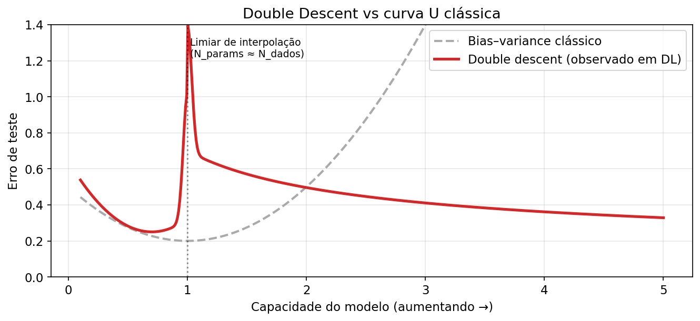
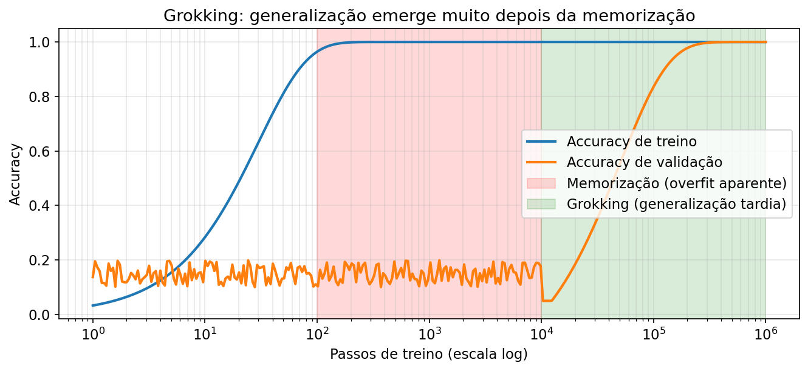
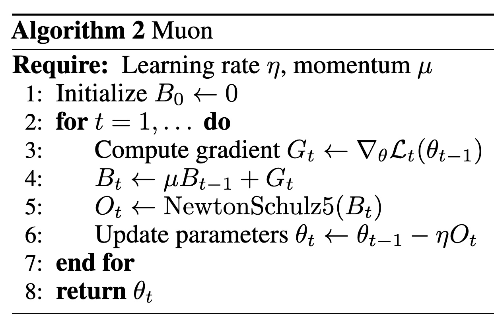
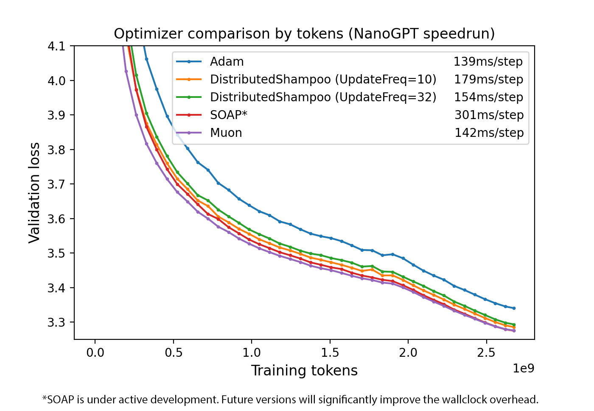
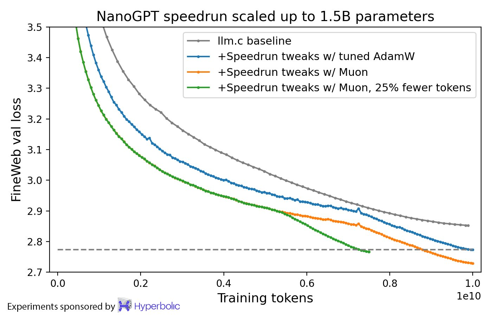
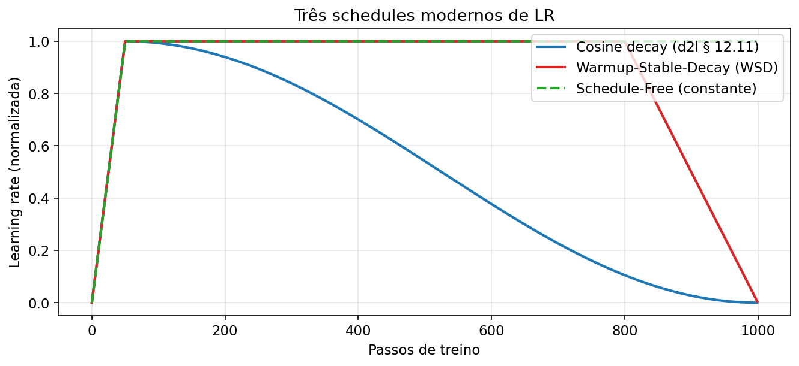
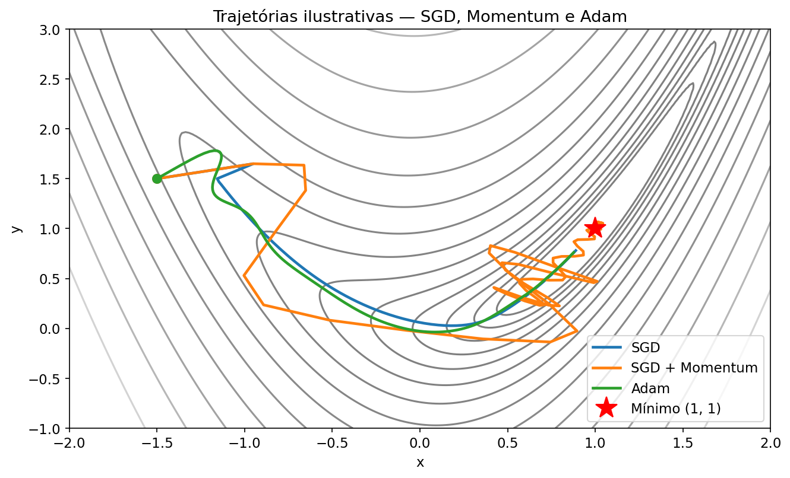

# Atualizações 2023 → 2026 para o Módulo 2: Algoritmos de Otimização

> **Objetivo**  —  este documento complementa o PDF `modulo_2_leitura_base_concatenada.pdf` (extrato do livro *Dive into Deep Learning*, 2021/2023) apontando o que mudou, o que ficou **legado**, e o que é hoje **prática padrão** em 2026.
>
> A forma é didática: cada seção do PDF recebe um bloco **“O que mudou desde 2023”** com o estado atual da arte, referências, e flags do tipo 🟢 *ainda válido*, 🟡 *parcialmente desatualizado*, 🔴 *considerado legado*.
>
> **Escopo coberto pelo PDF**
> - §3.7 *Weight Decay*
> - §5.5 *Generalization in Deep Learning*
> - §5.6 *Dropout*
> - §12.4 *Stochastic Gradient Descent*
> - §12.5 *Minibatch SGD*
> - §12.6 *Momentum*
> - §12.10 *Adam*
> - §12.11 *Learning-Rate Scheduling* (aparece nas páginas finais)

---

## Índice

1. [Sumário executivo — o que está legado vs. atual](#1-sumário-executivo)
2. [§3.7 Weight Decay](#2-weight-decay-§37)
3. [§5.5 Generalização em Deep Learning](#3-generalização-em-deep-learning-§55)
4. [§5.6 Dropout](#4-dropout-§56)
5. [§12.4 / §12.5 SGD e Minibatch SGD](#5-sgd-e-minibatch-sgd-§124-§125)
6. [§12.6 Momentum](#6-momentum-§126)
7. [§12.10 Adam → AdamW](#7-adam-§1210--adamw-na-prática)
8. [Novos otimizadores que não existem no PDF](#8-novos-otimizadores-pós-2023)
9. [§12.11 Learning-Rate Scheduling — cosine, WSD, Schedule-Free](#9-learning-rate-scheduling-§1211-revisitada)
10. [Meta-lições: scaling laws, precisão mista e o regime de LLMs](#10-meta-lições-scaling-laws-precisão-e-llms)
11. [Tabela-resumo final](#11-tabela-resumo-legado-vs-prática-2026)
12. [Referências](#12-referências)

---

## 1. Sumário executivo

O livro *Dive into Deep Learning* é um texto **excelente e ainda majoritariamente válido** — os conceitos fundacionais (taxa de aprendizado, gradiente estocástico, momentum, Adam, decaimento de peso) seguem sendo a base. A leitura cumpre plenamente o seu papel de construir a intuição.

Porém, entre 2023 e 2026 três eixos de mudança deslocaram a prática de ponta:

| Eixo | O que aconteceu |
|---|---|
| **O regime dominou** | LLMs de trilhões de parâmetros treinados por uma única época tornaram-se o caso de uso que mais exige inovação em otimização. Regras pensadas para CNNs multi-época (onde “overfit” é concreto) não se transferem direto. |
| **Novos otimizadores** | **AdamW** virou o default de facto no lugar de Adam; **Lion** (2023), **Sophia** (2023), **Muon** (2024) e **Schedule-Free AdamW** (2024) oferecem ganhos reais em *wall-clock* e começaram a entrar em produção (Muon é o otimizador do Kimi K2 trilionário da Moonshot AI). |
| **Novo entendimento teórico** | **Grokking**, **double descent**, **edge of stability** e a teoria **rich vs. lazy** reconceitualizaram o que significa "generalização" — várias intuições clássicas do livro (curva U do bias-variance, cross-validation como ouro absoluto) precisam de asteriscos. Também há uma compreensão mais sóbria: *weight decay* em LLMs **não regulariza no sentido clássico** — ele estabiliza a dinâmica de otimização ([Andriushchenko et al., NeurIPS 2024](https://proceedings.neurips.cc/paper_files/paper/2024/file/29496c942ed6e08ecc469f4521ebfff0-Paper-Conference.pdf)). |

O que o material do módulo mais deixa a desejar, nesta ordem:

1. Trata **Adam** como o ponto final; não discute **AdamW (decoupled weight decay)** que é o default desde ~2019 em transformers e é universal em LLMs.
2. **Dropout** é apresentado como regularização geral — em treinamento de LLMs ele hoje é **deliberadamente desligado** (LLaMA, Pythia, GPT-NeoX); a regularização que resta vem de stochastic depth / layer drop / attention dropout em modelos específicos.
3. **Learning-rate scheduling** acaba em *cosine / polinomial* — faltam **warmup** (prática universal), **WSD** (warmup-stable-decay), **D2Z** (decay-to-zero linear), e **Schedule-Free**.
4. Não cobre **scaling laws** (Chinchilla e derivados) — hoje são parte do léxico básico de um engenheiro de ML.
5. Não cobre **gradient clipping** como prática padrão, nem a interação de **bfloat16 / fp8** com o otimizador.

---

## 2. Weight Decay (§3.7)

### 2.1 Como o PDF trata

O livro apresenta weight decay no contexto clássico:

- Equivale a **penalidade L² no loss**:  
  $L(\theta) + \tfrac{\lambda}{2}\|\theta\|_2^2$
- Em SGD puro, isto gera a atualização  
  $\theta \leftarrow (1 - \eta\lambda)\theta - \eta\, g_t$.
- A intuição vendida é: **menos capacidade efetiva → menor overfit**, uma regularização no sentido clássico.

### 2.2 O que mudou desde 2023 🟡 *parcialmente desatualizado*

#### (a) A distinção L² × Weight-Decay virou essencial com Adam

O livro aplica L² sem distinguir de weight decay porque para SGD eles são idênticos. **Em Adam, não são.** Loshchilov & Hutter ([arxiv:1711.05101](https://arxiv.org/abs/1711.05101)) mostraram em 2019 que somar $\lambda \theta$ ao gradiente (o que é "L²") é *diferente* de aplicar o decaimento diretamente no passo $\theta \leftarrow \theta - \eta\lambda\theta$ depois do update adaptativo. A versão correta chama-se **AdamW (decoupled weight decay)**:

$$
\begin{aligned}
m_t &= \beta_1 m_{t-1} + (1-\beta_1) g_t \\
v_t &= \beta_2 v_{t-1} + (1-\beta_2) g_t^2 \\
\theta_t &= \theta_{t-1} - \eta\Big[\underbrace{\hat m_t / (\sqrt{\hat v_t} + \epsilon)}_{\text{passo do Adam}} + \underbrace{\lambda\, \theta_{t-1}}_{\text{decoupled WD}}\Big]
\end{aligned}
$$

AdamW é o **default de facto em transformers desde ~2019**, e o livro nem o menciona. Qualquer código PyTorch sério hoje usa `torch.optim.AdamW`, e HuggingFace faz o mesmo.

🔴 **Legado**: usar `optim.Adam` com `weight_decay=…` em transformer/LLM. A implementação do PyTorch aplica a penalidade como L², degradando levemente o efeito esperado.

#### (b) O papel real do weight decay em LLMs é *dinâmica*, não regularização

Um dos trabalhos mais citados de 2024 é **“Why Do We Need Weight Decay in Modern Deep Learning?”** de Andriushchenko et al. (NeurIPS 2024, [paper](https://proceedings.neurips.cc/paper_files/paper/2024/file/29496c942ed6e08ecc469f4521ebfff0-Paper-Conference.pdf), [código](https://github.com/tml-epfl/why-weight-decay)). A tese central contraria frontalmente a narrativa clássica do livro:

> *“Weight decay is never useful as an explicit regularizer but instead changes the training dynamics in a desirable way.”*

Dois mecanismos distintos:

- **Em visão (multi-época, sobre-treino)** – weight decay *amplifica* o ruído implícito do SGD, que via seu implicit bias controla a norma do Jacobiano → melhor generalização. Não é o termo da penalidade em si, é a interação com a dinâmica.
- **Em LLMs (1-época, regime de sub-treino)** – weight decay balanceia bias-variance do próprio estimador estocástico, reduz *training loss* (não só test), e **previne divergências repentinas em mixed precision bfloat16** — utilidade prática *sine qua non*, não regularização.

#### (c) λ muda conforme a escala do modelo

[Wang et al. 2024](https://arxiv.org/pdf/2405.13698) mostram que o λ ideal depende do número de passos de treino e do tamanho do modelo — a "regra" λ=0.01 que funciona para BERT não é a regra para um LLM 7B/70B. Hoje, **λ ∈ [0.01, 0.1]** é o corredor típico, frequentemente **λ=0.1** em pretraining de LLMs.

#### (d) Weight decay **não** é aplicado a todos os parâmetros

Convenção universal em LLMs (adotada desde o GPT-2 e reforçada em LLaMA/Qwen/Mistral): **bias e ganhos (γ) do LayerNorm/RMSNorm ficam fora do weight decay**. O livro não fala disto. Em código típico:

```python
no_decay = ["bias", "LayerNorm.weight", "norm.weight"]
optim_groups = [
    {"params": [p for n,p in model.named_parameters() if not any(nd in n for nd in no_decay)],
     "weight_decay": 0.1},
    {"params": [p for n,p in model.named_parameters() if any(nd in n for nd in no_decay)],
     "weight_decay": 0.0},
]
```

### 2.3 Discrepâncias com o PDF

| Ponto do PDF | Estado em 2026 |
|---|---|
| "weight decay é regularização L²" | Só verdade em SGD puro. 🟡 |
| Adam + weight_decay (fórmula implícita) | **Substituir por AdamW.** 🔴 |
| Intuição: λ controla capacidade | Mecanismo real é dinâmico (estabiliza o training), sobretudo em bf16. |
| Aplicar λ uniformemente | Excluir bias e norm weights é padrão. |

---

## 3. Generalização em Deep Learning (§5.5)

### 3.1 Como o PDF trata

O capítulo 5.5 discute:
- overfitting revisitado com redes profundas,
- insights de não-paramétrica (k-NN),
- *early stopping* como regularizador clássico,
- menciona penalidades de norma, que já aparecem no cap. 3.7.

### 3.2 O que mudou desde 2023 🟡

Três fenômenos redefiniram o que significa "generalizar" em redes profundas. Nenhum aparece no PDF.

#### (a) Double descent — a curva U foi substituída

Desde Nakkiran et al. (2019) sabemos que, ao aumentar capacidade do modelo, o erro de teste segue uma curva **não-monotônica**: sobe perto do *interpolation threshold* (onde N_params ≈ N_dados) e depois **cai de novo**, indo para regimes sobreparametrizados.



Consequência didática: a heurística clássica "adicione parâmetros até overfittar" do livro está certa apenas no ramo esquerdo da curva. Modelos modernos operam deliberadamente à direita do pico.

🟡 **Atualização**: o livro menciona que redes muito grandes podem generalizar — mas não dá nome ao fenômeno nem explicita a curva. Referência canônica: [Nakkiran et al., OpenReview](https://openreview.net/forum?id=B1g5sA4twr), [The Simple Truth of Double Descent (2024)](https://arxiv.org/html/2504.12700).

#### (b) Grokking — generalização tardia

Power et al. (2022), depois aprofundado até 2025, observaram que em tarefas algorítmicas redes atingem **100% de acurácia de treino rapidamente, validação fica no chute por ~10⁴–10⁶ passos, e então — de repente — a validação sobe para 100%**. É o grokking.



O que faz o salto acontecer? Três linhas de explicação que convergiram entre 2023-2025:
- **Eficiência de circuito**: quando várias sub-redes atingem loss de treino baixo, weight decay prefere a mais "eficiente" em norma, e esta tende a ser a que *generaliza* — Nanda et al., [Explaining grokking through circuit efficiency](https://arxiv.org/pdf/2309.02390).
- **Transição lazy → rich**: o modelo começa no regime NTK/*lazy* (features fixas), e só depois passa para o regime *rich* onde aprende representações — [Lyle, 2025](https://clarelyle.com/posts/2025-06-22-grokking.html).
- **Minimização de rank**: queda da val loss coincide com descoberta de pesos de rank baixo ([OpenReview](https://openreview.net/pdf?id=6NHnsjsYXH)).

Implicação prática: cross-validation ingênua, como descrita no livro, pode te dizer **“não está generalizando”** quando na verdade falta paciência de treino + weight decay suficiente.

#### (c) Edge of Stability

Cohen et al. (2021) e várias continuações (2023–2025) mostraram que redes grandes treinadas com gradiente *descendo* (não estocástico) operam no regime de **Edge of Stability (EoS)**: o maior autovalor do Hessiano sobe até ~ $2/\eta$ e *oscila* nesse limite — não converge a um mínimo "bom" no sentido clássico. Em SGD, o análogo é que $\operatorname{tr}(H) \le 2/\eta$ em mínimos lineares-estáveis ([Wu & Su, ICML 2023](https://arxiv.org/abs/2305.17490)). Consequência: taxas de aprendizado **maiores** do que as que o livro recomendaria como "seguras" são precisamente as que produzem boa generalização, porque o ruído implícito do SGD exerce regularização espontânea.

#### (d) Sharpness-Aware Minimization (SAM) e variantes

Foret et al. (2021) propuseram **SAM** — um otimizador que minimiza o loss *na vizinhança* dos parâmetros, não só no ponto, procurando mínimos "planos" (correlacionados com melhor generalização). Em 2024 apareceram variantes importantes:
- **F-SAM** (Friendly SAM) — [Li et al., CVPR 2024](https://openaccess.thecvf.com/content/CVPR2024/papers/Li_Friendly_Sharpness-Aware_Minimization_CVPR_2024_paper.pdf)
- **Lookahead-SAM** — [Yu et al., ICML 2024](https://proceedings.mlr.press/v235/yu24q.html)
- **MNSAM** (momentum-accelerated SAM) — [ScienceDirect 2025](https://www.sciencedirect.com/science/article/abs/pii/S0950705125010123)

Limitação: SAM dobra o custo por passo (duas passagens forward/backward). Em CV ainda compensa; em LLMs o custo inviabiliza na escala de trilhões de parâmetros.

#### (e) Scaling laws como lente de generalização

Chinchilla ([Hoffmann et al., 2022](https://arxiv.org/abs/2203.15556)) formalizou que para o mínimo compute-optimal, o número de *tokens* deve crescer proporcionalmente ao número de parâmetros. Regra prática citada na época: ~20 tokens por parâmetro. Em 2024-2025 isto evoluiu:

- Com inferência massiva, vale **treinar mais tempo** em um modelo menor que Chinchilla-optimal ([Sardana et al. 2024](https://arxiv.org/abs/2401.00448)).
- Modelos atuais (LLaMA 3.1, Qwen3, Mistral) usam razões 100–60 000:1 (Qwen3-0.6B treinou com 60 000 tokens/parâmetro — record em 2025).
- **Farseer** (2024) refina a predição da lei de escala com erro 4× menor que Chinchilla em grande escala ([paper](https://arxiv.org/html/2405.14578v2)).

### 3.3 Discrepâncias com o PDF

| Ponto do PDF | Estado em 2026 |
|---|---|
| Curva U clássica do bias-variance | Substituída por *double descent* para redes profundas. 🔴 |
| Early stopping como ferramenta principal | Ainda válido para fine-tuning. 🟡 *mas em pretraining é impraticável.* |
| Regularização = controle de capacidade | Regularização em LLMs é majoritariamente *implícita* (SGD noise, weight decay dinâmico). 🟡 |
| Sem menção a grokking / EoS / scaling laws | Adicionar estes três é essencial para intuição atual. |

---

## 4. Dropout (§5.6)

### 4.1 Como o PDF trata

- Dropout "padrão" (inverted) com taxa $p$ aplicada a ativações durante o treino.
- Benefício: desacopla co-adaptações; aproximação bayesiana a um *ensemble*.
- Código do zero e versão concisa com `nn.Dropout`.
- Implicitamente trata dropout como prática universal.

### 4.2 O que mudou desde 2023 🔴 *fortemente desatualizado para o regime LLM*

#### (a) LLMs de ponta **não usam dropout no pretraining**

Olhe o código:
- **LLaMA 1/2/3** — dropout 0 em `model.py` ([issue](https://github.com/facebookresearch/llama/issues/231)).
- **Pythia, OPT, GPT-NeoX, Mistral, Qwen2/3, DeepSeek-V3, Kimi K2** — também não.

Por quê? Pretraining de LLMs é feito em **uma única passada pelos dados** (ou menos). Não há "overfit" no sentido clássico porque o modelo jamais reencontra o mesmo exemplo. Isto foi sistematicamente testado em [Kristensen et al. 2025, *Drop Dropout on Single-Epoch Language Model Pretraining*](https://arxiv.org/abs/2505.24788): **remover dropout melhora perplexity**, o modelo sem dropout é estatisticamente superior dado orçamento de passos suficiente.

> **Regra de bolso 2026**: dropout=0.0 para pretraining de LLMs. Em fine-tuning em datasets pequenos, ~0.1 ainda é comum.

🔴 **Legado**: aplicar dropout=0.1 "por padrão" em um transformer grande sendo pré-treinado.

#### (b) Variações "estruturadas" que ainda são úteis

Dropout clássico quase desapareceu de pretraining LLM, mas suas variantes em nichos específicos continuam:

- **Stochastic Depth / DropPath** (Huang et al. 2016) — "dropar" blocos residuais inteiros. Universal em ViT/ConvNeXt/Swin. Não é aplicada a LLMs de bilhões de parâmetros, mas é **padrão em redes de visão** de 2022 em diante.
- **LayerDrop** (Fan et al. 2019) — baseline para pruning de profundidade em transformers. **DropPEFT** (2025) estendeu a ideia para federated fine-tuning de LLMs ([arxiv 2503.10217](https://arxiv.org/abs/2503.10217)).
- **AttentionDrop** (2025) — perturba a distribuição do softmax atencional durante o treino ([arxiv 2504.12088](https://arxiv.org/pdf/2504.12088)).
- **Residual Dropout** (2024, [ACL SIGUL](https://aclanthology.org/2024.sigul-1.35.pdf)) — dropout aplicado apenas nas conexões residuais, útil em fine-tuning de baixos recursos.
- **DropBlock** (2018) — ainda a escolha certa para CNNs (drop de regiões espacialmente contíguas).

#### (c) Attention dropout e residual dropout ainda vivem em alguns modelos

GPT-2 tinha `attn_pdrop=0.1` e `resid_pdrop=0.1`. BERT tinha `hidden_dropout_prob=0.1` e `attention_probs_dropout_prob=0.1`. Esses **valores defaults ainda aparecem em código-base** de LLMs open-source, mas os checkpoints pré-treinados reais de 2023–2026 são, quase sempre, rodados com `p=0.0`. O dropout só volta (e com p=0.1) em **fine-tuning supervisionado em dataset pequeno**.

### 4.3 Discrepâncias com o PDF

| Ponto do PDF | Estado em 2026 |
|---|---|
| Dropout como "regularizador-padrão" | Verdade em redes pequenas com múltiplas épocas. 🟡 |
| Mesma receita para NLP moderno | Não. LLMs usam p=0 em pretraining. 🔴 |
| Sem menção a DropPath / LayerDrop / AttentionDrop | Adicionar estas variantes. |

---

## 5. SGD e Minibatch SGD (§12.4, §12.5)

### 5.1 Como o PDF trata

- Atualização $\theta \leftarrow \theta - \eta_t \nabla L$ com $\eta_t$ decrescente.
- Análise de convergência para objetivo convexo, $O(1/\sqrt{t})$.
- Minibatch: vetorização e caches, discussão empírica de velocidade.

### 5.2 O que mudou desde 2023 🟢 *majoritariamente válido*

Esta parte envelheceu bem. Três refinamentos importantes:

#### (a) Regra de scaling de LR com batch size

O livro menciona vagamente que aumentar batch permite aumentar LR. Em 2024 a comunidade consolidou:

- **Linear scaling** (Goyal et al. 2017): para SGD puro em CV, $\eta \propto B$. Ainda funciona.
- **Square-root scaling** para Adam/AdamW: $\eta \propto \sqrt{B}$ — esta é a regra relevante em LLM training ([Malladi, Princeton Blog 2024](https://www.cs.princeton.edu/~smalladi/blog/2024/01/22/SDEs-ScalingRules/)).
- **Surge phenomenon** (NeurIPS 2024, [paper](https://proceedings.neurips.cc/paper_files/paper/2024/file/ef74413c7bf1d915c3e45c72e19a5d32-Paper-Conference.pdf)): a LR ótima **sobe e depois cai** conforme batch cresce; o ponto de "pico" se move para batches maiores ao longo do treino.

#### (b) SGD ainda reina em parte da visão computacional

Em CV (ResNet, ConvNeXt), **SGD + momentum + Nesterov** com cosine decay frequentemente generaliza melhor que Adam em *top-1 accuracy* — um fato empírico que o PDF não discute mas a comunidade aceita. Adam é o default em NLP; SGD em ImageNet/CIFAR competitivos.

#### (c) Implicit bias do SGD — peça-chave teórica

Ver §3.2(c) (Edge of Stability). A lição pragmática: SGD com **batch pequeno** e **LR grande** injeta ruído gradiente que atua como regularização — este ruído é **estruturado** (no subespaço dos gradientes por exemplo), não isotrópico, e essa estrutura é o que gera benefício ([arxiv 2305.17490](https://arxiv.org/abs/2305.17490)).

### 5.3 Discrepâncias

Poucas. A base conceitual do PDF continua sólida. Adicionar:
- as regras concretas de scaling de LR,
- que batch grandes (>1M tokens) são hoje padrão em LLMs (Llama-3 70B usou 4M tokens),
- o conceito de *implicit regularization* via SGD noise.

---

## 6. Momentum (§12.6)

### 6.1 Como o PDF trata

- Heavy-ball momentum: $v_t = \beta v_{t-1} + g_t$, $\theta \leftarrow \theta - \eta v_t$.
- Discussão de condicionamento (como momentum suaviza direções de alta curvatura).
- Nesterov momentum mencionado superficialmente.

### 6.2 O que mudou desde 2023 🟢 + 🟡

Momentum é fundação sólida, e continua fundação sólida. Mas apareceram extensões importantes.

#### (a) Nesterov hoje é o default até em otimizadores novos

Muon usa **Nesterov-style momentum** explicitamente por ter "empiricamente consistente melhor desempenho que momentum clássico" — ver seção do autor no [blog do Keller Jordan](https://kellerjordan.github.io/posts/muon/).

#### (b) Muon: momentum + ortogonalização

O otimizador mais comentado de 2024–2025 é, literalmente, **SGD-momentum reinterpretado geometricamente**. A ideia:

1. Calcule o momentum update $M_t$ como no heavy-ball.
2. Se $M_t$ é uma **matriz** (pesos de uma camada Linear), substitua-a pela matriz ortogonal mais próxima via **iterações de Newton–Schulz**.
3. Aplique o update ortogonalizado.



Por que funciona? Updates vindos de SGD-momentum têm alto *condition number* — são quase de rank baixo. Ortogonalizar "amplifica direções raras mas importantes" no update.





Resultados: **~35% de speedup wall-clock em NanoGPT**, **~2× eficiência computacional vs AdamW** em Mixture-of-Experts de 3B/16B no modelo Moonlight, e o **Kimi K2** (trilhão de parâmetros, Moonshot AI, 2025) foi treinado inteiro com Muon ([Liu et al. 2025, *Muon is Scalable for LLM Training*](https://arxiv.org/pdf/2502.16982)).

Detalhe prático: Muon é para **parâmetros 2D de camadas ocultas**. Embeddings, camadas de saída, biases e normas continuam em AdamW. O framework faz híbrido.

#### (c) Heavy-ball x Nesterov — entendimento melhor

Trabalhos teóricos recentes (2023-2025) refinaram quando Nesterov é estritamente melhor. Para objetivos fortemente convexos é claro; em redes profundas é empírico mas estável. A heurística sugerida no livro continua boa.

### 6.3 Discrepâncias

| Ponto do PDF | Estado em 2026 |
|---|---|
| Momentum como técnica aceleradora | 🟢 ainda correto |
| Nesterov como "variação secundária" | Hoje é frequentemente preferido; mencionar mais. 🟡 |
| Não menciona Muon | Adicionar como sucessor moderno do momentum clássico em LLMs 2D. |

---

## 7. Adam (§12.10) → AdamW na prática

### 7.1 Como o PDF trata

Apresenta Adam clássico (Kingma & Ba, 2015):

$$
\begin{aligned}
m_t &= \beta_1 m_{t-1} + (1-\beta_1) g_t \\
v_t &= \beta_2 v_{t-1} + (1-\beta_2) g_t^2 \\
\hat m_t &= m_t / (1 - \beta_1^t), \quad \hat v_t = v_t / (1 - \beta_2^t) \\
\theta_t &= \theta_{t-1} - \eta \, \hat m_t / (\sqrt{\hat v_t} + \epsilon)
\end{aligned}
$$

Apresenta variantes (Yogi), menciona bias-correction.

### 7.2 O que mudou desde 2023 🟡 (concepts OK; defaults desatualizados)

#### (a) AdamW é o default, não Adam

Já discutido em §2. Relembrando:

🔴 **Legado**: `torch.optim.Adam(model.parameters(), weight_decay=0.1)`  
🟢 **Atual**: `torch.optim.AdamW(model.parameters(), weight_decay=0.1)`

Até 2025, AdamW continua sendo descrito como **o gold standard** para treinamento de LLMs ([Metric Coders 2024](https://www.metriccoders.com/post/adamw-the-gold-standard-optimizer-for-training-llms)). Mesmo com Muon/Sophia superando-o em benchmarks, AdamW vence em *estabilidade, maturidade, suporte de ecossistema e menor risco de divergência em escala*.

#### (b) Hiperparâmetros em LLMs (2024-2025)

| Hiperparâmetro | Default do livro (CV/NLP 2021) | Prática 2024-2026 (LLM) |
|---|---|---|
| $\beta_1$ | 0.9 | 0.9 |
| $\beta_2$ | 0.999 | **0.95** (LLaMA, Mistral) ou 0.98 |
| $\epsilon$ | 1e-8 | 1e-8 em fp32; **1e-6 a 1e-7 em bf16/fp16** |
| weight decay (decoupled) | 0 | **0.1** típico em pretraining; 0.01 em fine-tuning |
| LR pico | 1e-3 a 1e-4 | **6e-4 a 3e-4** para pretraining; 1e-5 a 5e-5 para fine-tuning |
| warmup | ausente no livro | **1-10% dos passos totais** |
| gradient clipping | ausente no livro | **norma global 1.0** quase universal |

#### (c) Bias correction ainda relevante em bf16

A correção $\hat m / (1-\beta_1^t)$ do livro importa mais em bfloat16 do que em fp32, porque o começo do treino em bf16 é onde ocorrem as *sudden loss spikes* (pico de loss ou NaN). Weight decay + bias correction + grad clipping são a tríade anti-NaN em bf16.

#### (d) Memória de Adam vira gargalo

Adam guarda $m$ e $v$ — **2× o tamanho dos pesos** em estado do otimizador. Para um modelo de 70B parâmetros em bf16, é ~280 GB só de otimizador. Isso motivou:
- **Adafactor** (Shazeer & Stern, 2018) — fatoriza $v$, economia brutal. Usado em treinamentos T5/PaLM.
- **8-bit Adam** (Dettmers, 2022) — quantiza estados. Padrão em fine-tuning eficiente.
- **Lion** (2023) — só guarda $m$ (economia de 50% vs Adam). Ver §8.
- **DistributedShampoo / Muon** — razões de eficiência diferentes, mas igualmente relevantes.

### 7.3 Discrepâncias

| Ponto do PDF | Estado em 2026 |
|---|---|
| Adam com defaults (β₁=.9, β₂=.999, ε=1e-8) | β₂=.95, ε=1e-8 ou 1e-7 em bf16. 🟡 |
| Não menciona AdamW | **Acrescentar**. 🔴 |
| Não menciona Lion/Sophia/Muon | **Acrescentar**. 🔴 |
| Não menciona warmup, grad clipping | **Adicionar como prática padrão** em LLMs. 🔴 |

---

## 8. Novos otimizadores pós-2023

Nenhum destes está no PDF. Estes são os **mais relevantes** para um estudante de 2026 conhecer.

### 8.1 Lion (2023) — EvoLved Sign Momentum

**Paper**: [Chen et al. 2023, *Symbolic Discovery of Optimization Algorithms*](https://arxiv.org/abs/2302.06675). Descoberto por **busca simbólica automatizada** no Google Brain.

Update em uma linha:

$$
\theta_t \leftarrow \theta_{t-1} - \eta\,\operatorname{sign}(\beta_1 m_{t-1} + (1-\beta_1) g_t),\quad m_t = \beta_2 m_{t-1} + (1-\beta_2) g_t
$$

**Características**:
- Só guarda $m$ (metade da memória de Adam).
- Update tem magnitude uniforme $\pm\eta$ (pelo `sign`).
- LR típica **3–10× menor** que AdamW.
- $\beta_1=0.9, \beta_2=0.99$ (note: diferente de Adam).
- Vantagens: 2-15% speedup em várias tarefas, FID 2.3× melhor em difusão, 88.3% zero-shot ImageNet.
- **Limitações**: mais sensível a LR/weight decay que AdamW; em LLM pretraining sério, benchmarks mistos.

Status 2026: **produção em difusão**, competitivo em LLM.

### 8.2 Sophia (2023) — Hessian diagonal leve

**Paper**: [Liu et al. 2023, ICLR 2024](https://arxiv.org/abs/2305.14342). Stanford.

Ideia: usar uma **estimativa diagonal do Hessiano** como pré-condicionador, atualizada a cada ~10 passos (custo desprezível).

$$
\theta_t \leftarrow \theta_{t-1} - \eta\cdot\operatorname{clip}\big(m_t / \max(\hat H_t, \gamma\cdot \text{ref}), -1, 1\big)
$$

O clipping elemento a elemento controla updates extremos.

**Resultados**: 2× speedup em GPT-125M a 1.5B vs AdamW em passos e wall-clock. A lei de escala **favorece Sophia**: o gap para AdamW cresce com o tamanho do modelo.

**Status 2026**: academicamente vibrante, menos adotado em produção que Muon — por custo de implementação do Hessian-vector-product e sensibilidade à implementação.

### 8.3 Muon (2024) — Momentum Orthogonalized

Já detalhado em §6.2(b). Resumo:

- Treina **camadas 2D** (todas as Linear do transformer, exceto embedding/head).
- ~2× eficiência vs AdamW em LLMs, ~35% speedup em NanoGPT.
- Treinou o Kimi K2 trilionário (Moonshot AI, 2025).
- Newton-Schulz estável em bf16 — **vantagem decisiva sobre alternativas que exigem fp32** para ortogonalizar.

### 8.4 Shampoo / SOAP / SPlus (2018 → 2024-2025)

**Shampoo** (Gupta et al. 2018) é um otimizador de segunda ordem que aproxima o Hessiano como produto de Kronecker de duas matrizes por camada. Foi relativamente obscuro até a **Algoperf benchmark** do MLCommons (2024), onde a variante do **Meta (facebookresearch/optimizers)** ganhou com 28% de redução em wall-clock vs Adam.

**SOAP** ([Vyas et al. 2024](https://arxiv.org/html/2409.11321v1)) — "Shampoo with Adam in Preconditioner's eigenbasis". Combina o pré-condicionador de Shampoo com o loop interno do AdamW. Vence tanto Shampoo quanto AdamW em LLM pretraining (360M, 660M).

**SPlus** (2025, [arxiv 2506.07254](https://arxiv.org/html/2506.07254v3)) — estabiliza Shampoo com atualizações infrequentes do eigenbasis, usado em Transformer training de grande escala.

**Status 2026**: adotados em times grandes com infraestrutura dedicada. Menos portáveis que AdamW/Muon.

### 8.5 Schedule-Free AdamW (2024)

**Paper**: [Defazio et al. 2024, *The Road Less Scheduled*](https://arxiv.org/abs/2405.15682), NeurIPS 2024. Meta FAIR.

Ideia central: **elimina a necessidade de um schedule de LR**. Em vez de decair o LR, mantém três sequências de parâmetros ($z$, $y$, $x$) e faz uma combinação de Polyak-Ruppert averaging com Primal averaging.

Update simplificado:

```
y_t = (1-β) z_t + β x_t     # ponto de avaliação do gradiente
z_{t+1} = z_t - η ∇L(y_t)   # atualização estilo AdamW
x_{t+1} = (1 - 1/(t+1)) x_t + (1/(t+1)) z_{t+1}  # média acumulada (evaluated)
```

**Vantagens**:
- Nenhum hiperparâmetro extra sobre AdamW.
- Não precisa saber a duração do treino ex-ante — útil em cenários onde você quer parar "quando der".
- LR ótima **10×-50× maior** que com schedule em SGD; **1×-10× maior** em AdamW.
- Ganhou o track **Self-Tuning** do MLCommons AlgoPerf 2024.

**Limitação**: BatchNorm/LayerNorm precisam de cuidado especial na avaliação.

Implementação: [`pip install schedulefree`](https://pypi.org/project/schedulefree/) — wrap em volta de AdamW.

### 8.6 Prodigy / D-Adaptation — otimizadores *parameter-free*

**Paper**: [Mishchenko & Defazio 2024, ICML 2024](https://proceedings.mlr.press/v235/mishchenko24a.html).

Ideia: **você não precisa setar LR** — o otimizador estima a "distância inicial ao ótimo" $D$ durante o treino e ajusta a LR automaticamente. Melhora D-Adaptation por um fator $O(\sqrt{\log(D/d_0)})$.

**Uso típico 2026**: padrão do HuggingFace Diffusers para DreamBooth LoRA fine-tuning. Em LLM pretraining, não é o mainstream mas é uma ferramenta excelente para *early experiments* onde você não quer tunar LR.

### 8.7 RAdam, NAdam, AdaBelief, Adan, AdaPlus

Família de "extensões do Adam":

- **NAdam** — Adam + Nesterov. Disponível em TF/Keras desde sempre, útil mas marginal.
- **RAdam** — corrige instabilidade do começo do treino no Adam; hoje é amplamente substituído por *warmup + AdamW*.
- **AdaBelief** — variância da *direção* em vez da magnitude; nicho.
- **Adan** (2023-2024) — Adam + Nesterov com trick no gradient estimation; comparado com Lion em benchmarks.
- **AdaPlus** (2024, [arxiv 2309.01966](https://arxiv.org/html/2309.01966)) — combina Nesterov + AdaBelief em cima de AdamW.

**Status 2026**: todos ainda existem como opções em Optax/Keras, mas nenhum deles é *o default* em LLM training.

### 8.8 Mapa de decisão atualizado (2026)

```
│  Qual é seu regime?                                 │
│                                                      │
│  CV/ResNet/ViT small-medium  → SGD+Momentum / Lion  │
│  Difusão / Stable Diffusion  → Lion / AdamW         │
│  LLM fine-tuning             → AdamW (seguro)       │
│                              → Prodigy (se não tunar LR) │
│  LLM pretraining < 1B        → AdamW ou Schedule-Free AdamW │
│  LLM pretraining ≥ 1B        → AdamW (prod) ou Muon (fronteira) │
│  Infra avançada + grande time → SOAP / DistributedShampoo │
```

---

## 9. Learning-Rate Scheduling (§12.11) revisitada

O PDF apenas começa a tratar este tópico (fica no fim do capítulo 12.11). Como é tema central e central, detalhamos os schedules que **hoje são padrão**.



### 9.1 Warmup + Cosine decay

Padrão dominante de 2018 até hoje. Warmup linear de $0 \to \eta_{\max}$ ao longo de 1-10% dos passos, seguido por cosine até $0$ (ou até $0.1\,\eta_{\max}$). **GPT-3, LLaMA 1/2/3, Mistral** — todos esta receita.

### 9.2 Warmup-Stable-Decay (WSD) — novo padrão emergente

Três fases:
1. **Warmup**: linear $0 \to \eta_{\max}$ (curto, 1-2%).
2. **Stable**: $\eta_{\max}$ constante por ~80-90% dos passos.
3. **Decay**: queda agressiva (linear ou exponencial) até perto de 0 nos últimos 10-20%.

![WSD vs Cosine — ver imagens_atualizacoes/lr_schedules_comparacao.png]

**Por que WSD se tornou popular?** [Hägele et al. 2024, *Understanding WSD*](https://arxiv.org/html/2410.05192v1) explica via o *river-valley loss landscape*:
- Durante a fase stable, o loss permanece maior que no cosine — mas o modelo explora a "ravina" rapidamente.
- No decay final, o loss **despenca** — frequentemente termina **abaixo** do cosine equivalente.

Vantagem operacional: você pode **checkpoint antes do decay** e continuar treinando mais depois, sem ter o "horizon lock" do cosine.

### 9.3 Decay-to-Zero (D2Z) linear

[Bergsma et al. 2025](https://arxiv.org/pdf/2502.15938) mostra que **decair linearmente até zero** supera sistematicamente cosine-a-10% em LLMs, especialmente em altos tokens-per-parameter. Virou recomendação de ponta em 2025.

### 9.4 Schedule-Free — nenhum schedule

Já visto em §8.5. Alternativa: não decair, deixar a média Polyak fazer o trabalho. Praticamente **ninguém usa cosine sem Schedule-Free ser uma opção avaliada** em treinos novos de 2025 em diante.

### 9.5 Discrepâncias

| Ponto do PDF | Estado em 2026 |
|---|---|
| Cosine e polinomial como principais schedules | Ambos ainda usados, mas WSD e D2Z emergiram como fortes concorrentes. 🟡 |
| Sem menção a warmup | **Warmup é universal**. Adicionar. 🔴 |
| Schedule como "o que você decide sobre η(t)" | Para Schedule-Free, o paradigma muda. |

---

## 10. Meta-lições: Scaling laws, precisão e LLMs

Temas que **não estão no PDF** mas são hoje parte do vocabulário básico.

### 10.1 Scaling laws e training compute-optimal

- **Chinchilla** (Hoffmann et al. 2022): para compute fixo, escalar modelo e dados juntos; ~20 tokens/parâmetro.
- **Inference-aware** (2024): se você vai servir o modelo a muita gente, treine um modelo **menor** por **mais tempo**.
- Modelos atuais (LLaMA 3.1, Qwen3): 100–10 000 tokens/parâmetro.

Implicação para otimização: com **muitos mais tokens por parâmetro**, estamos no regime de **sub-treino** de Andriushchenko et al. — onde weight decay age via dinâmica, não regularização.

### 10.2 Precisão mista e seu impacto no otimizador

- **bfloat16** (BF16): intervalo de expoente amplo, mantissa curta (7 bits). Raramente precisa loss scaling. **Default em LLM training 2023-2026.**
- **fp16**: maior precisão, mas exige loss scaling dinâmico. Obsoleto fora de inferência.
- **fp8** (E4M3/E5M2): usado em DeepSeek-V3 e recentes para forward/backward com scaling fino por tensor. DeepSeek-V3 fez fine-grained FP8 com group size 128 + acumulação FP32 a cada 4 WGMMA.

**Impacto no otimizador**: em bf16, o $\epsilon$ de Adam frequentemente precisa ser **1e-6 ou 1e-7** (em vez de 1e-8). Weight decay previne *sudden loss spikes* que são mais comuns em bf16 que fp32 ([Andriushchenko et al. 2024](https://proceedings.neurips.cc/paper_files/paper/2024/file/29496c942ed6e08ecc469f4521ebfff0-Paper-Conference.pdf)).

### 10.3 Gradient clipping — padrão universal

Em **todos** os LLMs modernos: `torch.nn.utils.clip_grad_norm_(model.parameters(), max_norm=1.0)`. O PDF não discute. Sem isso, um único batch adversarial pode descarrilar o treino.

### 10.4 Efeito de instabilidade e perda de spike

Spikes de loss (o loss explode temporariamente e pode NaN-ar) são o fantasma do LLM training. Os três remédios padrão:
- gradient clipping,
- warmup longo,
- weight decay adequado.

Quando acontecem, às vezes se rebobina ao último checkpoint e **pula batch(es) suspeitos**. Literatura: [Chowdhery et al. 2022 (PaLM paper)](https://arxiv.org/abs/2204.02311), [Scao et al. 2022 (BLOOM)](https://arxiv.org/abs/2211.05100).

---

## 11. Tabela-resumo: legado vs. prática 2026

| Tópico do PDF | Status | Motivo |
|---|---|---|
| Weight decay via L² (Adam) | 🔴 legado | Use AdamW. |
| λ uniforme em todos parâmetros | 🟡 parcial | Excluir bias e normas é padrão. |
| Curva U bias-variance | 🟡 incompleta | Falta *double descent*. |
| Dropout em transformers | 🔴 legado em LLM pretrain | Default em LLMs é p=0. Em CV/fine-tuning mantém. |
| SGD vanilla | 🟢 sólido | Acréscimo: regras de scaling de LR, implicit bias. |
| Minibatch SGD + vetorização | 🟢 sólido | Adicionar: sqrt-scaling para Adam, surge phenomenon. |
| Momentum (heavy-ball) | 🟢 sólido | Nesterov é comum; Muon estende. |
| Adam | 🟡 defaults velhos | β₂=0.95, ε=1e-7 em bf16, usar AdamW. |
| Bias correction | 🟢 ainda importa | Especialmente em bf16. |
| Cosine/polinomial schedule | 🟡 incompleto | WSD/D2Z/Schedule-Free. |
| Ausência de warmup | 🔴 desatualizado | Warmup é universal. |
| Ausência de gradient clipping | 🔴 desatualizado | Norma 1.0 é default. |
| Sem scaling laws | 🔴 grande lacuna | Chinchilla + inference-aware. |
| Sem mixed precision | 🔴 grande lacuna | bf16/fp8 são padrão. |
| Sem Lion/Sophia/Muon/Shampoo/SOAP | 🔴 lacuna | Todos emergiram pós-livro. |
| Sem Schedule-Free / Prodigy | 🔴 lacuna | Tópico ativo em MLCommons 2024-2025. |

---

## 12. Referências

### Papers seminais (novos otimizadores e atualizações teóricas)

- Loshchilov & Hutter (2019). *Decoupled Weight Decay Regularization (AdamW).* [arXiv:1711.05101](https://arxiv.org/abs/1711.05101)
- Andriushchenko et al. (2024). *Why Do We Need Weight Decay in Modern Deep Learning?* NeurIPS 2024. [Paper PDF](https://proceedings.neurips.cc/paper_files/paper/2024/file/29496c942ed6e08ecc469f4521ebfff0-Paper-Conference.pdf) · [código](https://github.com/tml-epfl/why-weight-decay)
- Wang et al. (2024). *How to set AdamW's weight decay as you scale model and dataset size.* [arXiv:2405.13698](https://arxiv.org/pdf/2405.13698)
- Chen et al. (2023). *Symbolic Discovery of Optimization Algorithms (Lion).* [arXiv:2302.06675](https://arxiv.org/abs/2302.06675)
- Liu et al. (2023). *Sophia: A Scalable Stochastic Second-order Optimizer for LLM Pre-training.* ICLR 2024. [arXiv:2305.14342](https://arxiv.org/abs/2305.14342)
- Jordan et al. (2024). *Muon: An optimizer for hidden layers.* [Blog post canônico](https://kellerjordan.github.io/posts/muon/) · [GitHub](https://github.com/KellerJordan/Muon)
- Liu et al. (2025). *Muon is Scalable for LLM Training (Moonshot AI).* [arXiv:2502.16982](https://arxiv.org/pdf/2502.16982) · [Moonlight code](https://github.com/MoonshotAI/Moonlight)
- Vyas et al. (2024). *SOAP: Improving and Stabilizing Shampoo using Adam.* [arXiv:2409.11321](https://arxiv.org/abs/2409.11321)
- Defazio et al. (2024). *The Road Less Scheduled (Schedule-Free).* NeurIPS 2024. [arXiv:2405.15682](https://arxiv.org/abs/2405.15682) · [GitHub](https://github.com/facebookresearch/schedule_free)
- Mishchenko & Defazio (2024). *Prodigy: An Expeditiously Adaptive Parameter-Free Learner.* ICML 2024. [OpenReview](https://openreview.net/forum?id=WpQbM1kBuy) · [GitHub](https://github.com/konstmish/prodigy)

### Scaling laws

- Hoffmann et al. (2022). *Training Compute-Optimal LLMs (Chinchilla).* [arXiv:2203.15556](https://arxiv.org/abs/2203.15556)
- Sardana et al. (2024). *Beyond Chinchilla-Optimal: Accounting for Inference in LM Scaling Laws.* [arXiv:2401.00448](https://arxiv.org/abs/2401.00448)

### Generalização moderna

- Nanda et al. (2023). *Explaining Grokking through Circuit Efficiency.* [arXiv:2309.02390](https://arxiv.org/pdf/2309.02390)
- Wu & Su (2023). *The Implicit Regularization of Dynamical Stability in SGD.* ICML 2023. [arXiv:2305.17490](https://arxiv.org/abs/2305.17490)
- Clare Lyle (2025). *What's grokking good for?* [blog](https://clarelyle.com/posts/2025-06-22-grokking.html)
- Li et al. (2024). *Friendly Sharpness-Aware Minimization.* CVPR 2024. [Paper PDF](https://openaccess.thecvf.com/content/CVPR2024/papers/Li_Friendly_Sharpness-Aware_Minimization_CVPR_2024_paper.pdf)

### Learning-rate scheduling

- Hägele et al. (2024). *Understanding Warmup-Stable-Decay Learning Rates.* [arXiv:2410.05192](https://arxiv.org/html/2410.05192v1)
- Bergsma et al. (2025). *Why linearly decaying the learning rate to zero works best.* [arXiv:2502.15938](https://arxiv.org/pdf/2502.15938)

### Dropout em LLMs

- Kristensen et al. (2025). *Drop Dropout on Single-Epoch Language Model Pretraining.* Findings of ACL 2025. [arXiv:2505.24788](https://arxiv.org/abs/2505.24788)
- Zhao et al. (2024). *Revisiting Structured Dropout.* [PMLR](https://proceedings.mlr.press/v222/zhao24a/zhao24a.pdf)
- Lan et al. (2025). *AttentionDrop.* [arXiv:2504.12088](https://arxiv.org/pdf/2504.12088)

### Recursos interativos e didáticos

- [Google PAIR — Do ML Models Memorize or Generalize?](https://pair.withgoogle.com/explorables/grokking/) (explorer interativo de grokking)
- [Michael Brenndoerfer — AdamW decoupled weight decay (interactive)](https://mbrenndoerfer.com/writing/adamw-optimizer-decoupled-weight-decay)
- [Fabian Schaipp — Joint tuning of LR and WD for AdamW](https://fabian-sp.github.io/posts/2024/02/decoupling/)
- [Emergent Mind — WSD Learning Rate Scheduling](https://www.emergentmind.com/topics/warmup-stable-decay-wsd-learning-rate-scheduling)

---

## Apêndice A — Trajetórias ilustrativas (SGD, Momentum, Adam)



Reprodução didática das intuições do §12.4-12.6 do livro em uma superfície de Rosenbrock esticada. SGD oscila nas direções de alta curvatura; momentum suaviza; Adam adapta o tamanho do passo por-parâmetro. Os três convergem, mas gastam "caminhos" bem diferentes. O código que gerou esta figura está em `imagens_atualizacoes/` (fonte deste markdown).

---

*Documento gerado em abril de 2026 como complemento ao PDF de leitura base do Módulo 2 (Deep Learning, MsC AI UC Boulder).*
